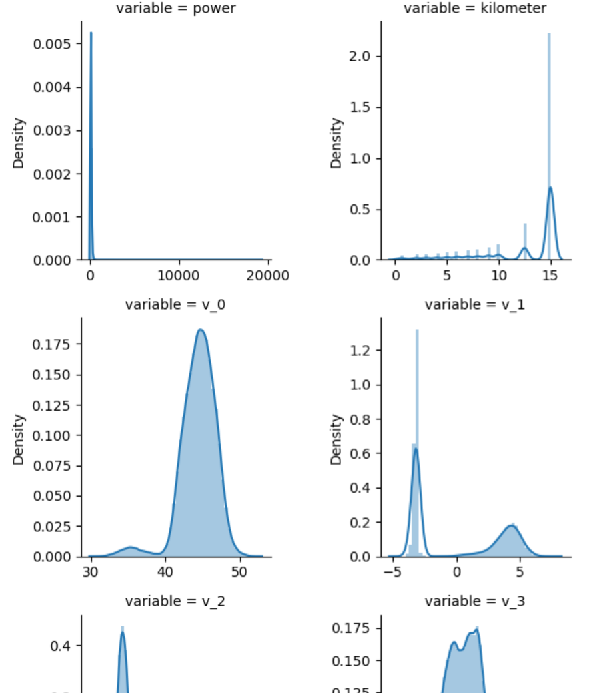
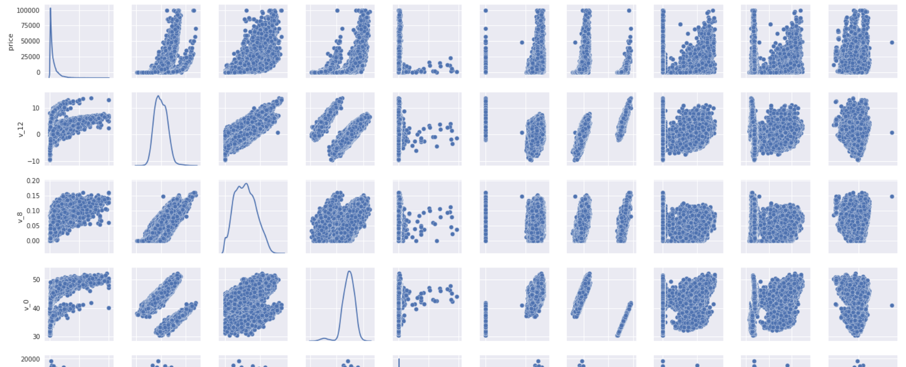
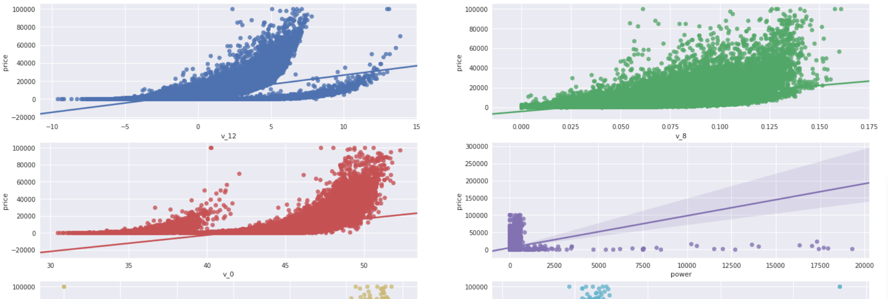
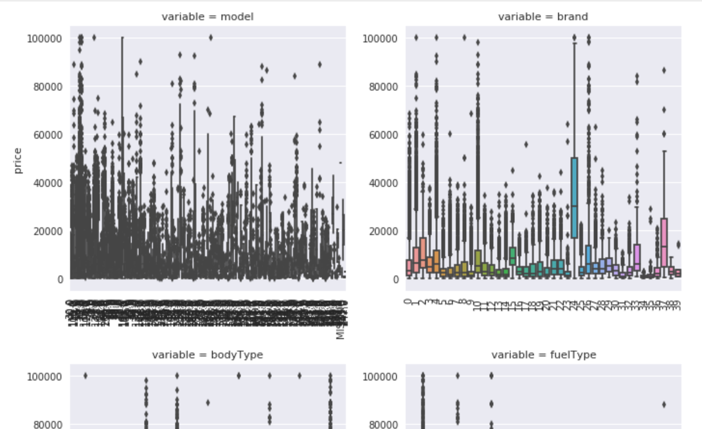
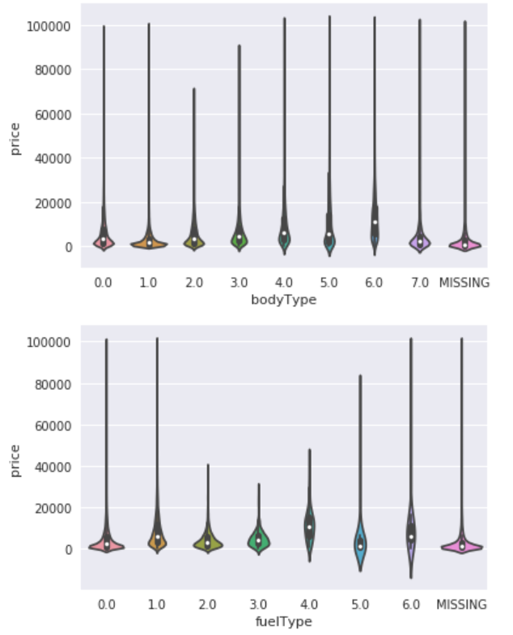
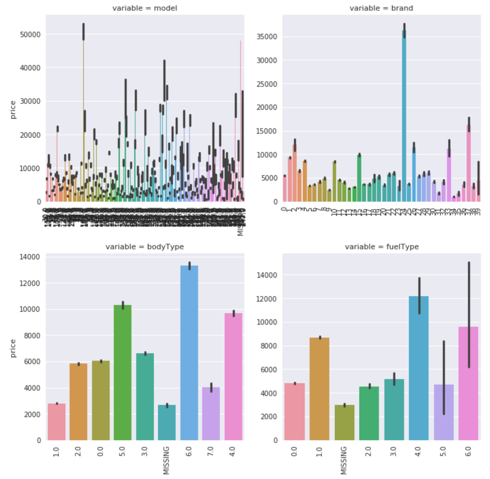
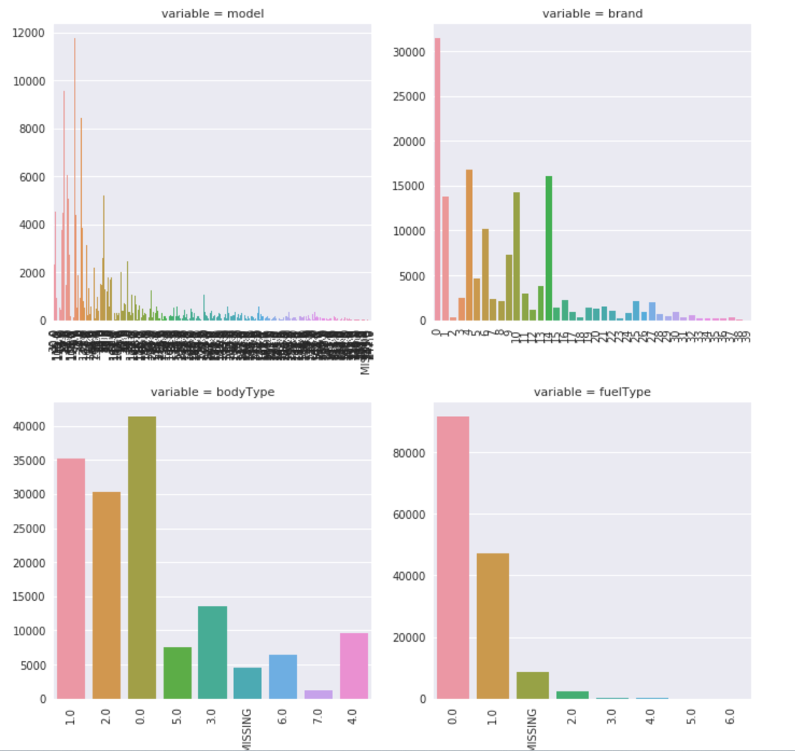

# EDA-2

**载入数据和数据概况**

- 载入训练集
- 粗略观察训练集和测试集
- `describe()`统计量如何观察，掌握数据范围，异常值判断，**999 9999 -1** 等值这些其实都是`nan`的另外一种表达方式，观察是否有，看训练集和测试集的分布差异，若分布不一致后续可以采样
- `info()`查看数据类型，通过`info`来了解数据每列的type，有助于了解是否存在除了`nan`以外的特殊符号异常
- 模型预测的值的统计信息可以和标签信息进行比较一下，尤其关注有无异常值也就是**9999**等
- 随机森林、xgb等新算法在特征工程时，可以省略归一化，在线性模型，lr等模型上需要归一化，统一量纲

**数据缺失和异常**

- 判断缺失值的存在，`.isnull().sum()`
- 如何处理异常值
- 将`nan`值可视化，用上述缺失统计后的数据。主要是有缺失值的列的`nan`个数，n行两列。列分别是有缺失值的特征名和该特征名的缺失值个数。使用`.plot.bar()`。
- 
- 使用`missingno.matrix`可视化缺失值，白色表示缺失值，左侧数据，1和250表示样本数量的始末；右侧数字，28表示无缺失值的列数，31表示统计的总列数。
- `missingno as msno`：使用`msno.bar`可视化缺失值。上图高度越低说明缺失值越多，左侧纵坐标为数据非缺失值所占的百分比，右侧纵坐标为数据非缺失值的数量。
- 使用`pd.info`再次检查一下，object类型可能有缺失值，可以用`pd.unique()`和`pd.value_counts()`统计一下唯一值的数量。这里针对某个缺失值多的数据进行检查，发现存在'-'缺省值。**可以先不处理缺省值，一些模型可以支持**。`replace`将缺省值替换成`np.nan`，别忘了再次统计。
- 利用`pd.value_counts()`可以看一下数据是否有**严重倾斜现象**，例如，这两类数据仅有两个值，对预测没有帮助可以删除。

**分析预测值分布**

* 预测值的唯一值出现次数。
* 使用可视化函数`seaborn`和`scipy`的统计库`import scipy.stats as st`，画出几种分布图。例如，无界约翰逊分布、正态分布和对数正态分布。`distplot`画直方图，`kde`拟合密度估计曲线，默认为`True`，即图中的拟合曲线，`fit`使用随机分布拟合，这里使用了上述三种分布拟合。价格不服从正态分布，所以在进行**回归**之前，它必须进行**转换**。虽然对数变换做得很好，但最佳拟合是无界约翰逊分布。

```python
import scipy.stats as st
y = Train_data['price']
plt.figure(1); plt.title('Johnson SU')
sns.distplot(y, kde=False, fit=st.johnsonsu)
plt.figure(2); plt.title('Normal')
sns.distplot(y, kde=False, fit=st.norm)
plt.figure(3); plt.title('Log Normal')
sns.distplot(y, kde=False, fit=st.lognorm)
```


* 查看预测值的偏度和峰度，skewness and kurtosis，`sns.skew()和sns.kurt()`，可参考[偏度和峰度]([Markdown 链接语法 | Markdown 官方教程](https://markdown.com.cn/basic-syntax/links.html))。接着查看其他特征数据的偏度和峰度，并且特征的偏度和峰度作可视化。感觉看偏度和峰度最主要的目的是判断是否是正态分布，并且决定做什么变换
* 查看预测值的直方图，即频数。`plt.hist(Train_data['price'], orientation = 'vertical',histtype = 'bar', color ='red')`。观察预测值取对数后的分布。

```python
# log变换 z之后的分布较均匀，可以进行log变换进行预测，这也是预测问题常用的trick
plt.hist(np.log(Train_data['price']), orientation = 'vertical',histtype = 'bar', color ='red') 
plt.show()
```

**将特征分为类别特征和数字特征，查看类别特征unique分布**

**列**

- name - 汽车编码
- regDate - 汽车注册时间
- model - 车型编码
- brand - 品牌
- bodyType - 车身类型
- fuelType - 燃油类型
- gearbox - 变速箱
- power - 汽车功率
- kilometer - 汽车行驶公里
- notRepairedDamage - 汽车有尚未修复的损坏
- regionCode - 看车地区编码
- seller - 销售方 【以删】
- offerType - 报价类型 【以删】
- creatDate - 广告发布时间
- price - 汽车价格
- v_0', 'v_1', 'v_2', 'v_3', 'v_4', 'v_5', 'v_6', 'v_7', 'v_8', 'v_9', 'v_10', 'v_11', 'v_12', 'v_13','v_14'【匿名特征，包含v0-14在内15个匿名特征】

最好也将预测值单独拿出来。划分操作如下：

```python
Y_train = Train_data['price']  # 预测值（标签）
numeric_features = ['power', 'kilometer', 'v_0', 'v_1', 'v_2', 'v_3', 'v_4', 'v_5', 'v_6', 'v_7', 'v_8', 'v_9', 'v_10', 'v_11', 'v_12', 'v_13','v_14' ]  # 数字特征

categorical_features = ['name', 'model', 'brand', 'bodyType', 'fuelType', 'gearbox', 'notRepairedDamage', 'regionCode',]  # 类别特征
```

* 使用`nunique`和`value_counts()`查看每个特征唯一值的个数和唯一值出现的次数，测试集也别忘了看

**数字特征分析**

数字特征别忘了加上预测值。

* 相关性分析，使用`pd.corr()`分析特征间的相关性，查看预测值与其他特征的相关性

```python
## 相关性分析
price_numeric = Train_data[numeric_features]
correlation = price_numeric.corr()
print(correlation['price'].sort_values(ascending = False),'\n')
```

* 可视化相关性矩阵图，相关性可以看特征间的相关程度，若是过高，不满足相互独立假设，有可能要剔除其中之一，但是随机森林等树模型不用，使用`sns.heatmap(data.corr(),linewidths=0.1,vmax=1.0, square=True,linecolor='white', annot=True)`相关性和热力图如下：


* 同样查看特征的偏度和峰度
* 使用`pd.melt()`重新将原始训练数据按数字特征重新排列，宽数据变长数据
* 接着使用`sns.FacetGrid()`和`FacetGrid.map()`画出每列数据，查看特征的分布，**这一步不太懂**，如下

```python
## 每个数字特征得分布可视化
f = pd.melt(Train_data, value_vars=numeric_features)  # numeric_feature是数字特征的列
g = sns.FacetGrid(f, col="variable",  col_wrap=2, sharex=False, sharey=False)  # col_wrap=2表示最终显示2列图
g = g.map(sns.distplot, "value")
```



* 数字特征相互之间的关系可视化，如下

```python
## 数字特征相互之间的关系可视化
sns.set()  # 设置绘图风格
columns = ['price', 'v_12', 'v_8' , 'v_0', 'power', 'v_5',  'v_2', 'v_6', 'v_1', 'v_14']
sns.pairplot(Train_data[columns],size = 2 ,kind ='scatter',diag_kind='kde')
plt.show()
```



* 多变量互相回归关系可视化，我觉得是多变量分别与预测值的回归关系可视化，挑选了几个特征，没有用全部特征，`sns.regplot`

```python
## 多变量互相回归关系可视化
fig, ((ax1, ax2), (ax3, ax4), (ax5, ax6), (ax7, ax8), (ax9, ax10)) = plt.subplots(nrows=5, ncols=2, figsize=(24, 20))  # 这里画了5行2列的图，共10个特征
# ['v_12', 'v_8' , 'v_0', 'power', 'v_5',  'v_2', 'v_6', 'v_1', 'v_14']
v_12_scatter_plot = pd.concat([Y_train,Train_data['v_12']],axis = 1)  # 第一个特征
sns.regplot(x='v_12',y = 'price', data = v_12_scatter_plot,scatter= True, fit_reg=True, ax=ax1)
```



**类别特征分析**

* 查看一下每个类别特征的唯一值个数，`nunique()`

* 类别特征箱形图可视化，需要注意把数据类型转为类别类型，绘图工具同数字特征

```python
## 类别特征箱形图可视化

# 因为 name和 regionCode的类别太稀疏了，这里我们把不稀疏的几类画一下
categorical_features = ['model',
 'brand',
 'bodyType',
 'fuelType',
 'gearbox',
 'notRepairedDamage']
for c in categorical_features:
    Train_data[c] = Train_data[c].astype('category')
    if Train_data[c].isnull().any():
        Train_data[c] = Train_data[c].cat.add_categories(['MISSING'])
        Train_data[c] = Train_data[c].fillna('MISSING')

def boxplot(x, y, **kwargs):
    sns.boxplot(x=x, y=y)
    x=plt.xticks(rotation=90)

f = pd.melt(Train_data, id_vars=['price'], value_vars=categorical_features)
g = sns.FacetGrid(f, col="variable",  col_wrap=2, sharex=False, sharey=False, size=5)
g = g.map(boxplot, "value", "price")
```



* 小提琴图可视化，都是针对预测值的，即纵轴的是预测值

```python
## 类别特征的小提琴图可视化
catg_list = categorical_features
target = 'price'
for catg in catg_list :
    sns.violinplot(x=catg, y=target, data=Train_data)
    plt.show()
```



* 柱形图可视化

```python
## 类别特征的柱形图可视化
def bar_plot(x, y, **kwargs):
    sns.barplot(x=x, y=y)
    x=plt.xticks(rotation=90)

f = pd.melt(Train_data, id_vars=['price'], value_vars=categorical_features)
g = sns.FacetGrid(f, col="variable",  col_wrap=2, sharex=False, sharey=False, size=5)
g = g.map(bar_plot, "value", "price")
```



* 计数图可视化，即每个类别的频数可视化

```python
## 类别特征的每个类别频数可视化(count_plot)
def count_plot(x,  **kwargs):
    sns.countplot(x=x)
    x=plt.xticks(rotation=90)

f = pd.melt(Train_data,  value_vars=categorical_features)
g = sns.FacetGrid(f, col="variable",  col_wrap=2, sharex=False, sharey=False, size=5)
g = g.map(count_plot, "value")
```



* 生成数据报告pandas_profiling

```python
import pandas_profiling
pfr = pandas_profiling.ProfileReport(Train_data)
pfr.to_file("./example.html")
```

**EDA总结**

所给出的EDA步骤为广为普遍的步骤，在实际的不管是工程还是比赛过程中，这只是最开始的一步，也是最基本的一步。

接下来一般要结合模型的效果以及特征工程等来分析数据的实际建模情况，根据自己的一些理解，查阅文献，对实际问题做出判断和深入的理解。

最后不断进行EDA与数据处理和挖掘，来到达更好的数据结构和分布以及较为强势相关的特征。

数据探索在机器学习中我们一般称为**EDA**（Exploratory Data Analysis）：是指对已有的数据（特别是调查或观察得来的原始数据）在尽量少的先验假定下进行探索，通过作图、制表、方程拟合、计算特征量等手段探索数据的结构和规律的一种数据分析方法。

数据探索有利于我们发现数据的一些特性，数据之间的关联性，对于后续的特征构建是很有帮助的。

1. 对于数据的初步分析（直接查看数据，或`.sum(), .mean()，.descirbe()`等统计函数）可以从：样本数量，训练集数量，是否有时间特征，是否是时许问题，特征所表示的含义（非匿名特征），特征类型（字符类似，`int，float，time`），特征的缺失情况（注意缺失的在数据中的表现形式，有些是空的有些是`”NAN”`符号等），特征的均值方差情况。
2. 分析记录某些特征值缺失占比30%以上样本的缺失处理，有助于后续的模型验证和调节，分析特征应该是填充（填充方式是什么，均值填充，0填充，众数填充等），还是舍去，还是先做样本分类用不同的特征模型去预测。
3. 对于异常值做专门的分析，分析特征异常的label是否为异常值（或者偏离均值较远或者事特殊符号）,异常值是否应该剔除，还是用正常值填充，是记录异常，还是机器本身异常等。
4. 对于Label做专门的分析，分析标签的分布情况等。
5. 进步分析可以通过对特征作图，特征和label联合做图（统计图，离散图），直观了解特征的分布情况，通过这一步也可以发现数据之中的一些异常值等，通过箱型图分析一些特征值的偏离情况，对于特征和特征联合作图，对于特征和label联合作图，分析其中的一些关联性。